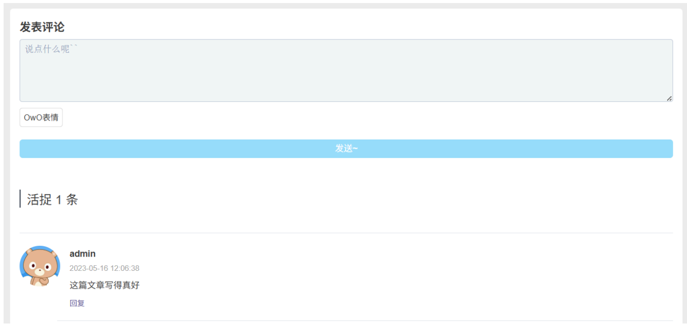
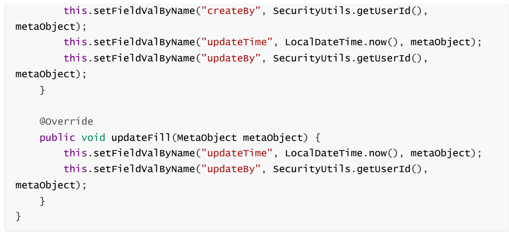
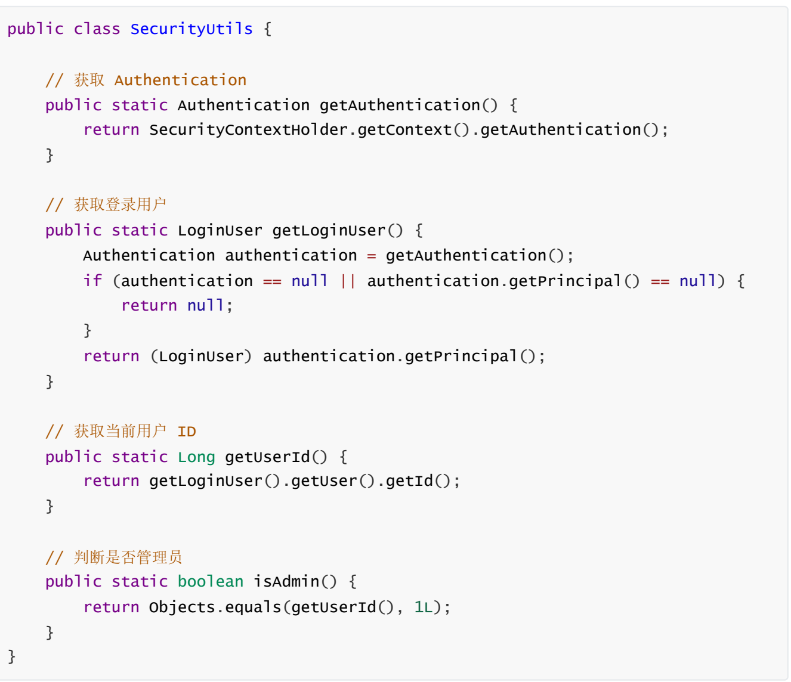
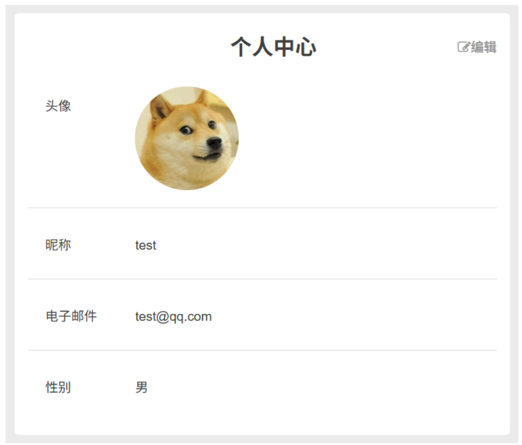
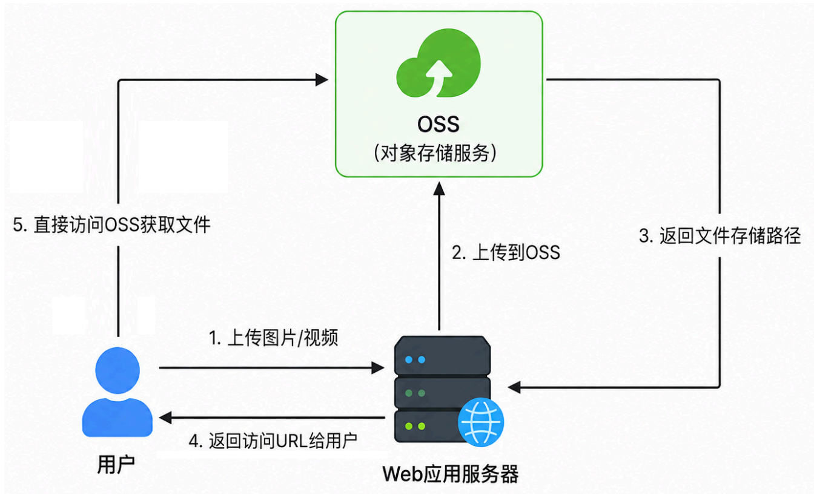
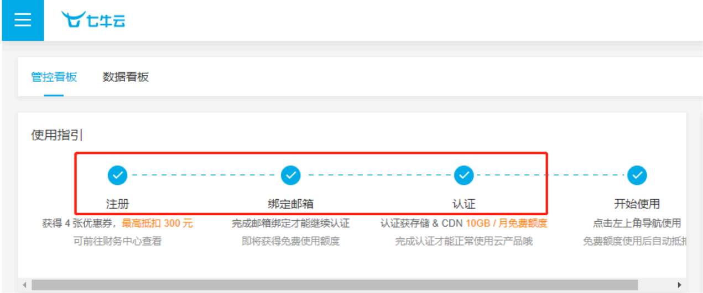
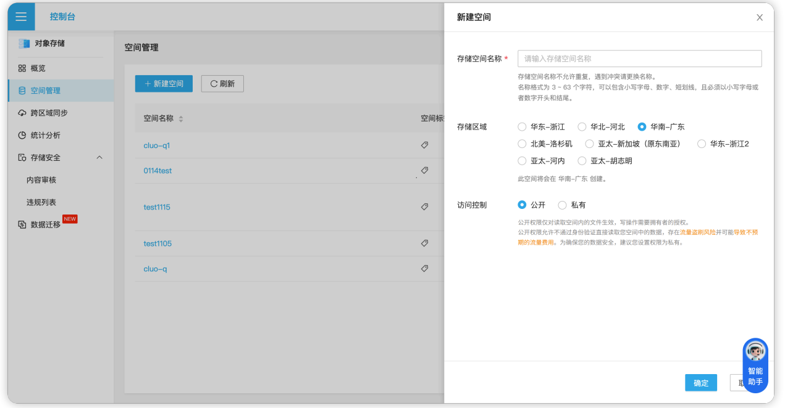
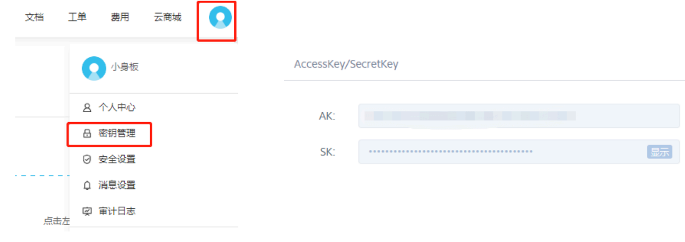

2.13发表评论接口

2.13.1需求

用户登录后可以对文章发表评论，也可以对评论进行回复。用户登录后也可以在友链页面进行评论。



2.13.2接口设计


| 请求方式 | 请求地址 | 请求头 |
| --- | --- | --- |
| POST | /comment | 需要 token头 |


请求体:

●●发表根评论(评论文章/友链):

{$$\text{articleId": 1,}$$"type": 0,$$\text{CommentId":}-1,$$"toCommentUserId":-1,"content":"这篇文章真不错"

●发表子评论(回复):

{"articleId": 1,"type": 0,"rootId":"3","toCommentId":"3","toCommentUserId":"1","content":"赞同"}


{"code": 200,"msg":"操作成功"}

2.13.3配置 MyBatis-Plus自动填充

在实际开发中,某些字段经常具有固定的赋值时机,例如:

●● create_time:新增数据时设置

●update_time:新增和修改数据时设置

如果每次新增、修改都手动赋值,会比较繁琐。MyBatis-Plus提供了自动填充功能,可以在执行新增或修改操作时，自动为指定字段赋值，操作步骤如下:

①使用@TableField指定自动填充策略

•●FieldFill.INSERT:表示只在新增时自动填充

●FieldFill.INSERT_UPDATE:表示在新增和修改时都自动填充

在 Comment类中为需要自动填充的字段对应属性添加注解

//创建人id

@TableField(fill= FieldFill.INSERT)

private Long createBy;

//创建时间

@TableField(fill= FieldFill.INSERT)

private LocalDateTime createTime;

//更新人id

@TableField(fill= FieldFill.INSERT_UPDATE)

private Long updateBy;

//更新时间

TableField(fill= FieldFill.INSERT_UPDATE)

private LocalDateTime updateTime;

编写自动填充处理器

新建 MyMetaObjectHandler类,实现 MetaObjectHandler接口

●执行 insert时,会自动给 createTime、 createBy、 updateTime和 updateBy赋值

•.执行 update时，会自动给 updateTime和 updateBy赋值

@Component

 public class MyMetaObjectHandler implements MetaobjectHandler{

@Override

 public void insertFill(Metaobject metaobject){

this.setFieldValByName("createTime",LocalDateTime.now(),metaobject);



SecurityUtils

●客户端携带合法 token发起请求时，JwtAuthenticationTokenFilter会解析 token获取用户 ID，从Redis查询出 LoginUser登录信息。然后以 LoginUser为主体构建Authentication认证对象，并将其存入SecurityContext，因此后续业务代码可直接从SecurityContext中获取当前登录用户信息



2.13.4代码实现

CommentController

@PostMapping public ResponseResult comment(@RequestBody Comment comment)return commentService.addComment(comment);}

CommentService

 ResponseResult addComment(Comment comment);

CommentServicelmpl

@override

 public ResponseResult addComment(Comment comment){...}

2.14个人信息接口

2.14.1需求

进入个人中心的时候需要能够查看当前用户信息



2.14.2接口设计


| 请求方式 | 请求地址 | 请求头 |
| --- | --- | --- |
| GET | /user/userInfo | 需要token请求头 |


Query格式请求参数:userld

响应格式:

{"code": 200,"data":{"avatar":"https://gss0.baidu.com/.../10a4c96.jpg","email":"test@qq.com","id":"2","nickName":"test","sex":"0"},"msg":"操作成功"}

2.14.3代码实现

UserController

@RestController@RequestMapping("/user")public class UserController{@Autowired private IUserservice userservice;@GetMapping("/userInfo")public ResponseResult userInfo(Long userId){return userService.userInfo(userId);}}

UserService

 public interface IUserservice extends IService<User>{ResponseResult userInfo(Long userId);}

UserServicelmpl

@Autowired

 private UserMapper userMapper;

@override

 public ResponseResult userInfo(Long userId)  $\{\ldots\}$ 

SecurityConfig

●配置个人信息接口/user/userInfo必须认证后才能访问

@Bean

 public securityFilterChain filterChain(HttpSecurity http) throws Exception{http.cors().and()


//登录接口允许匿名访问

.antMatchers("/login").anonymous()

//注销接口需要认证才能访问

$$\text{.antMatchers("/logout").authenticated()}$$

//发表评论接口需要认证才能访问

.antMatchers("/comment").authenticated()

//个人信息接口需要认证才能访问

$$\text{.antMatchers("/user/userInfo").authenticated()}$$

//除上面外的所有请求全部不需要认证即可访问

$$\text{.anyRequest().permitAll();}$$

2.15头像上传接口

2.15.1需求

在个人中心点击编辑的时候可以上传头像图片。上传完头像后，可以用于更新个人信息接口。

2.15.2 OSS简介

①为什么要使用OSS

如果把图片、视频等文件上传到自己的 Web应用服务器，在读取这些文件时就会占用比较多的资源，影响服务器性能。因此我们一般使用 OSS(Object Storage Service,对象存储服务)存储图片或视频。



②七牛云OSS注册使用

1.注册认证



2.创建存储空间，记录 bucket名（存储空间名称）



3. 生成密钥，记录 AccessKey 和 SecretKey



#  ③示例代码测试

项目创建时已添加过七牛云Maven依赖，这里可以直接对官方示例代码进行修改，在单元测试里测试七牛云的文件上传功能

```
public class QiniuTest {
    @Test
    void uploadTest() {
        //构造一个带指定 Region 对象的配置类
```

Configuration cfg= Configuration.create(Region.huanan());cfg.resumableuploadAPIversion=Configuration.ResumableuploadAPIversion.v2;//指定分片上传版本//...其他参数参考类注释UploadManager uploadManager= new UploadManager(cfg);//...生成上传凭证，然后准备上传String accesskey="Klf0OGFpthQos1C_zIg3wxavkeQjc-wHhKb4c4uo";String secretkey="YAIZEGvgdwiuB8bQTi1v0ck518vmpgLMEPP-ww7g";String bucket="ptu-blog-test";//默认不指定key的情况下，以文件内容的hash值作为文件名$$\text{ string key}=\text{ null;}$$try{//byte[] uploadBytes="hello qiniu cloud".getBytes("utf-8");//ByteArrayInputStream byteInputStream= new ByteArrayInputStream(uploadBytes);File file= new File("E:\\图片\\photo.png");//改成自己的本地文件路径FileInputStream byteInputStream= new FileInputStream(file);key= file.getName();Auth auth= Auth.create(accesskey, secretkey);String upToken= auth.uploadToken(bucket);try{Response response= uploadManager.put(byteInputStream, key,upToken, null, null);//解析上传成功的结果DefaultPutRet putRet= new Gson().fromJson(response.bodystring(),DefaultPutRet.class);System.out.println(putRet.key);System.out.println(putRet.hash);} catch(QiniuException ex){ex.printStackTrace();if(ex.response!= null){System.err.println(ex.response);try{$$\text{ string body}=\text{ ex.response.tostring}();$$System.err.println(body);} catch(Exception ignored){}} catch(FileNotFoundException ex){//ignore}}
