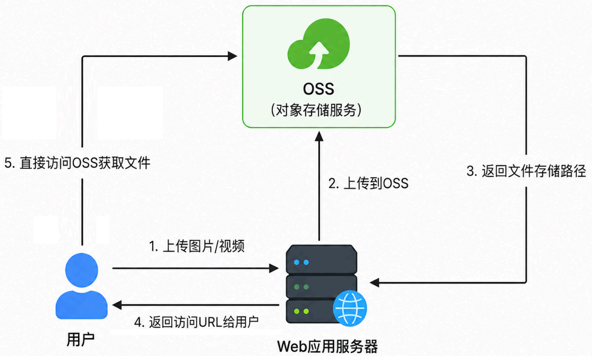
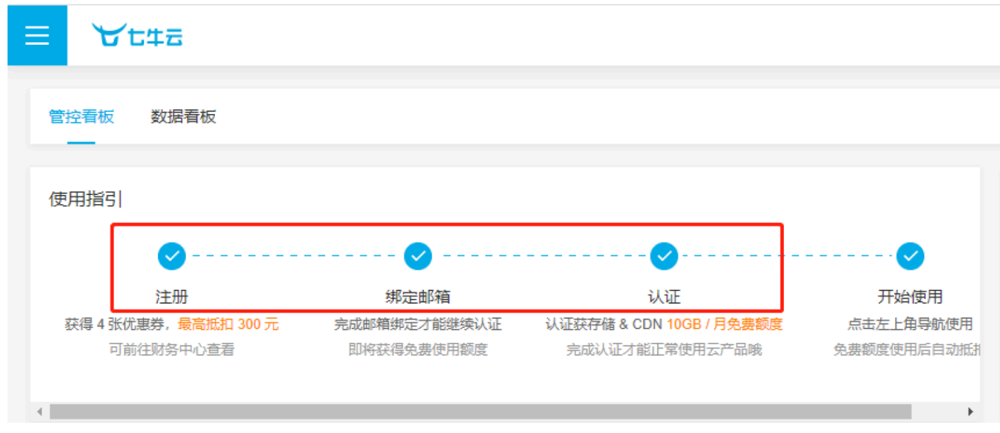
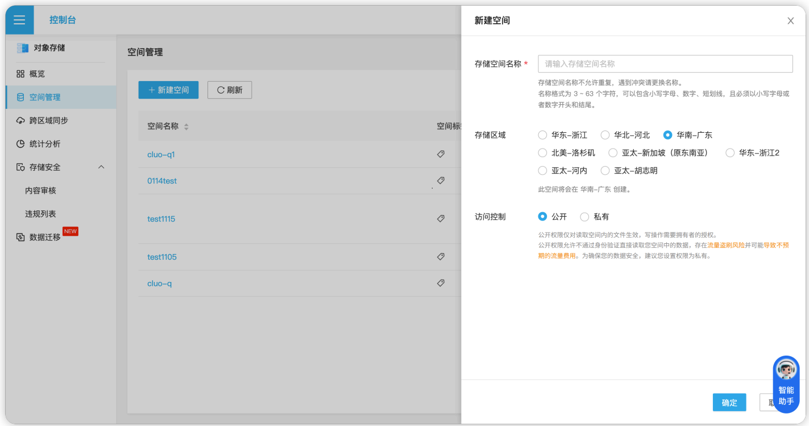
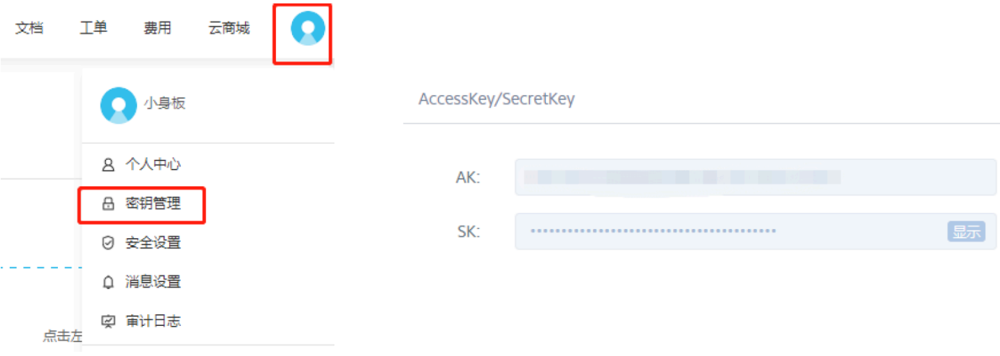

#  2.15 头像上传接口

##  2.15.1需求

在个人中心点击编辑的时候可以上传头像图片。上传完头像后，可以用于更新个人信息接口。

##  2.15.2 OSS

###  ①为什么要使用OSS

如果把图片、视频等文件上传到自己的Web应用服务器,在读取这些文件时就会占用比较多的资源,影响服务器性能。因此我们一般使用OSS(Object Storage Service,对象存储服务)存储图片或视频。



②七牛云 OSS注册使用

1.注册认证



2.创建存储空间，记录 bucket名



3.生成密钥，记录 AccessKey 和 SecretKey



#  ③示例代码测试

项目之前已添加七牛云Maven依赖，这里可以直接对官方示例代码进行修改，在单元测试里测试文件上传功能

public class QiniuTest {

```
@Test
  void uploadTest() {
    //构造一个带指定 Region 对象的配置类
    Configuration cfg = Configuration.create(Region.huanan());
    cfg,resumableUploadAPIVersion =
Configuration,ResumableUploadAPIVersion.V2;// 指定分片上传版本
    //...其他参数参考类注释
    UploadManager uploadManager = new UploadManager(cfg);
    //...生成上传凭证，然后准备上传
    String accessKey = "Klf00GFpthQoslC_zIg3wxaVkeQjc-WHhKb4c4uo";
    String secretKey = "YAIZEGvgdWiuB8bQTilv0ck518vmpgLMEPP-ww7g";
    String bucket = "ptu-blog-test";
    //默认不指定key的情况下，以文件内容的hash值作为文件名
    String key = null;
    try {
        // byte[] uploadBytes = "hello qiniu cloud".getBytes("utf-8");
    // ByteArrayInputStream byteInputStream = new
ByteArrayInputStream(uploadBytes);
        File file = new File("E:\图片\photo.png"); //改成你本地文件路径
    FileInputStream byteInputStream = new FileInputStream(file);
        key = file.getName();
        Auth   auth = Auth.create(accessKey, secretKey);
        String   upToken = auth.uploadToken(bucket);
        try {
          Response response = uploadManager.put(byteInputStream, key,
upToken, null, null);
          //解析上传成功的结果
          DefaultPutRet putRet = new Gson().fromJson(response.bodyString(),
DefaultPutRet.class);
          System.out.println(putRet.key);
          System.out.println(putRet.hash);
          } catch (QiniuException ex) {
          ex.printStackTrace();
          if (ex.response != null) {
          System.err.println(ex.response);
          try {
                    String body = ex.response.toString();
                    System.err.println(body);
                } catch (Exception ignored) {
          }
        }
      }
    } catch (FileNotFoundException ex) {
          //ignore
    }
  }
}
```

#  2.15.3 接口设计


| 请求方式 | 请求地址 | 请求头 |
| --- | --- | --- |
| POST | /upload | 不需要token |


参数：img,值为要上传的文件

请求头：Content-Type：multipart/form-data；

响应格式:

```
    {
        "code": 200,
        "data": "OSS文件访问链接",
        "msg": "操作成功"
}
```

##  2.15.4配置

①确保依赖配置且成功导入

```
    <!-- 七牛云0SS -->
    <dependency>
        <groupId>com.qiniu</groupId>
        <artifactId>qiniu-sdk</artifactId>
        <version>[7.19.0, 7.19.99]</version>
    </dependency>
        <dependency>
        <groupId>com.google.code.gson</groupId>
        <artifactId>gson</artifactId>
    </dependency>
```

②添加七牛云OSS的配置信息

application.yml (blog模块)

```
oss:
    accessKey: xxxx
    secretKey: xxxx
    bucket: ptu-blog-xxx
    domain: http://xxx.clouddn.com/
```

###  2.15.5代码实现

UploadController.java (blog模块)

```
@RestController
  public class UploadController {
    @Autowired
    private UploadService uploadService;
    @PostMapping("/upload")
    public ResponseResult uploadImg(MultipartFile img){
        return uploadService.uploadImg(img);
    }
  }
```

UploadService.java (framework模块)

```
public interface UploadService {
    ResponseResult uploadImg(MultipartFile img);
}
```

OSSUploadServiceImpl.java (framework模块)

基于官方示例代码：数据流上传修改如下

```
@Service
@Data
@ConfigurationProperties(prefix = "oss")
public class UploadServiceImpl implements UploadService {
  private String accessKey;
  private String secretKey;
  private String bucket;
  private String domain;
    // 定义允许的后缀 (统一小写)
  private static final List<String> ALLOWED_EXTENSIONS =
  Arrays.asList(".png", ".jpg", ".jpeg");
    @Override
  public ResponseResult upload(MultipartFile img) {
      // 合法性校验
      ...
      // 生成云上文件名
      String filePath = ...;
      // 上传文件到OSS
      String url = uploadOSS(img, filePath);
      return ResponseResult.okResult(url);
    }
```

```
private String uploadOSS(MultipartFile imgFile, String filePath) {
    // 参考官方示例代码:数据流上传进行修改
    ...
}
}
```

AppHttpCodeEnum (framework模块)

. . . . . . . . . . . . . . . . . . . . . . . . . . . . . . . . . . . . . . . . . . . . . . . . . . . . . . . . . . . . . . . . . . . . . . . . . . . . . . . . . . . . . . . . . . . . . . . . . . . . . . . . . . . . . . . . . . . . . . . . . . . . . . . . . . . . . . . . . . . . . . . . . . . . . . . . . . . . . . . . . . . . . . . . . . . . . . . . . . . . . . . . . . . . . . . . . . . . . . . . . . . . . . . . . . . . . . . . . . . . . . . . . . . . . . . . . . . . . . . . . . . . . . . . . .

PathUtils.java (framework模块)

```
public class PathUtils {
    public static String generateFilePath(String fileName) {
        // 根据日期生成路径
        SimpleDateFormat sdf = new SimpleDateFormat("yyyy/MM/dd/");
        String datePath = sdf.format(new Date());
        // 随机uuid作为文件名
        String uuid = UUID.randomUUID().toString().replaceAll("-", "");
        // 提取文件后缀名 test.jpg -> .jpg
        int index = fileName.lastIndexOf(".");
        String fileName = fileName.substring(index);
        // 返回完整文件路径
        return datePath + uuid + fileType;
    }
}
```

#  2.16更新个人信息接口

##  2.16.1需求

编辑完个人资料后，点击保存对个人资料进行更新。

##  2.16.2 接口设计


| 请求方式 | 请求地址 | 请求头 |
| --- | --- | --- |
| PUT | /user/userInfo | 需要token请求头 |


参数

请求体中json格式数据:

```
{
"avatar":"https://****/2026/06/12/948597e164614902ab1662ba8452e106.png",
    "email":"test@qq.com",
    "id":"3",
    "nickName":"ptu",
    "sex":"1"
l
```

响应格式:

{
        "code":200,
        "msg":"操作成功"
}
```

#  2.16.3代码实现

UserController (blog模块)

```
@PutMapping("/userInfo")
public ResponseResult updateUserInfo(@RequestBody User user){
    return userService.updateUserInfo(user);
}
```

UserService (framework模块)

ResponseResult updateUserInfo(User user);

UserServiceImpl (framework模块)

```
@Override
public ResponseResult updateUserInfo(User user) {
    userMapper.updateById(user);
    return ResponseResult.okResult();
}
```

#  2.17用户注册

##  2.17.1需求

●要求用户能够在注册界面完成用户的注册。

● 要求用户名，昵称，邮箱不能和数据库中原有的数据重复。如果某项重复了注册失败并且要有对应的提示。

● 要求用户名，密码，昵称，邮箱都不能为空。

●密码必须密文存储到数据库中。

#  2.17.2 接口设计


| 请求方式 | 请求地址 | 请求头 |
| --- | --- | --- |
| POST | /user/register | 不需要token请求头 |


参数

请求体中json格式数据:

```
{
        "email": "string",
        "nickName": "string",
        "password": "string",
        "username": "string"
}
```

响应格式:

```
{
        "code":200,
        "msg":"操作成功"
}
```

#  2.17.3代码实现

UserController (blog模块)

```
@PostMapping("/register")
public ResponseResult register(@RequestBody User user) {
    return userService.register(user);
}
```

UserService (framework模块)

ResponseResult register(User user);

UserServiceImpl (framework模块)

```
@Automired
private PasswordEncoder passwordEncoder;

@Override
public ResponseResult register(User user) {
    // 合法性校验
    ...
    // 重复性校验
    ...
    // 使用PasswordEncoder进行密文加密
    user.setPassword(...);
    // 保存
    userMapper.insert(user);
    return ResponseResult.okResult();
  }
  private boolean userNameExist(String userName) {
    ...
  }
  private boolean emailExist(String email) {
    ...
  }
```

AppHttpCodeEnum (framework模块)

public enum AppHttpCodeEnum {
    ..
    USERNAME_NOT_NULL(510, "用户名不能为空"),
    NICKNAME_NOT_NULL(511, "昵称不能为空"),
    PASSWORD_NOT_NULL(512, "密码不能为空"),
    EMAIL_NOT_NULL(513, "邮箱不能为空"),
    NICKNAME_EXIST(514, "昵称已存在"),
}
```

User (framework模块)

自动填充时间

```
public class User implements Serializable {
    ...
    @TableField(fill = FieldFill.INSERT)
    private LocalDateTime createTime;
```

@TableField(fill = FieldFill.INSERT_UPDATE)
private LocalDateTime updateTime;
}
```
