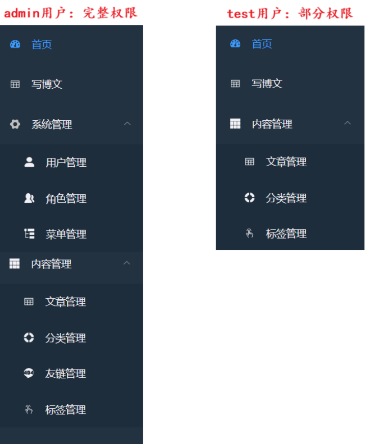

#  3.博客后台

博客后台采用基于角色的访问控制模型，即RBAC (Role-Based Access Control)。RBAC 是当前系统开发中较为主流且常用的权限管理方案，主要通过“用户—角色—权限”之间的关联关系，实现对系统操作权限的统一管理。

● 用户：系统的实际使用者，对应具体的账号或人员，例如张三、李四等。

● 角色：用户在系统中的身份或职责划分，例如编辑、审核员、超级管理员等。

●权限:用户可执行的具体操作，例如查看文章、编辑文章、删除账号、管理用户等。

在 RBAC 权限管理方式中，一个用户可以绑定一个或多个角色；一个角色也可以关联多个权限。用户最终拥有的权限 = 所绑定角色的权限集合。例如，给用户张三分配“编辑”角色，而“编辑”角色拥有“查看文章”和“编写文章”权限，那么张三登录系统后便自动拥有这两项权限。

通过这种设计方式，权限管理更加清晰、灵活。当系统需要调整某类用户的操作权限时，只需修改对应角色的权限配置，所有绑定该角色的用户都会自动生效，无需逐个修改用户权限，从而降低了维护成本，提高了权限管理效率。



##  3.1准备工作

1. 在后台模块 admin 的项目所在包下创建启动类 AdminApplication

```
@SpringBootApplication
  public class AdminApplication {
        public static void main(String[] args) {
            SpringApplication.run(AdminApplication.class, args);}
  }
```

2. 在后台模块 admin 的 resources 目录下创建 application.yml 配置文件 (可从blog模块中复制，修改端口号为8989)

server:
port: 8989
...

.使用 mybatis-plus-generator 生成后台模块 admin 要用到的表格对应代码

```
// 要生成代码的表，多个表用逗号分割
String `tableNames` = "sys_menu,sys_role,tag,article_tag";
// 要过滤的表前缀，多个前缀用逗号分割
String `tablePrefixes` = "sys_";
```

#  3.2后台登录

##  3.2.1需求

后台管理系统首先需要实现登录功能。系统中的所有后台业务接口，都必须在用户完成登录认证后才能访问。

后台系统的认证与授权同样基于 Spring Security 框架实现。用户登录成功后，系统会生成 JWT 令牌并返回给前端。前端后续访问后台接口时，需要在请求头中携带该 token，后端通过 token 校验用户身份。

##  3.2.2 接口设计


| 请求方式 | 请求路径 |
| --- | --- |
| POST | /user/login |


请求体:

{
                "username":"test",
                "password":"1234"
    }
```

响应格式:

```
{
        "code": 200,
        "data": {
            "token": "eyJhbGciOiJIUzI1NiJ9.eyJqdGkiOiI0ODBmOThmYmJkNmION"
        },
        "msg": "操作成功"
}
```

#  3.2.3代码实现

AdminLoginController

```
@RestController
public class AdminLoginController {
    @Automired
      private IAdminLoginService adminLoginService;

    @PostMapping("/user/login")
      public ResponseResult login(@RequestBody User user){
            if(!StringUtils.hasText(user.getName()))
                //提示：必须要传用户名
                throw new SystemException(AppHttpCodeEnum.REQUIRE_USERNAME);
            }
            return adminLoginService.login(user);
        }
    }
```

AdminLoginService

public interface IAdminLoginService {
ResponseResult login(User user);
}
```

AdminLoginServiceImpl (可基于前台登录的BlogLoginServiceImpl修改)


和 BlogLoginServiceImpl 的区别:

1. login 方法中存入 redis 的 key 前缀变为 adminlogin

2. 返回的数据中只需要包含 `token`

```
@Service
  public class AdminLoginServiceImpl implements IAdminLoginService {
      ...
      @Override
      public ResponseResult login(User user) {
          ...
          // 把用户信息存入redis
          redisCache.setCacheObject("adminlogin:"+userId,loginUser);
          // 将token封装返回
            Map<String, String> map = new HashSet>();
            map.put("token", jwt);
            return ResponseResult.okResult(map);
        }
  }
```

#  3.2.4 Spring Security 配置

在后台模块admin的filter包中添加JwtAuthenticationTokenFilter(可从blog模块中复制，将redis中获取用户信息的key前缀修改为adminlogin)

```
@Component
public class JwtAuthenticationTokenFilter extends OncePerRequestFilter {
    ...
      @Override
      protected void doFilterInternal(HttpServletRequest request,
  HttpServletResponse response, FilterChain filterChain) throws ServletException,
  IOException {
        ...
          //从redis中获取登录用户信息
          LoginUser loginUser = redisCache.getCacheObject("adminlogin:" + userId);
      ...
      }
  }
```

在后台模块 admin 的 config 包中添加 SecurityConfig 配置类 (可从blog模块中复制，修改请求的访问认证)

```
@Configuration
public class SecurityConfig {
      ...
      @Bean
    public SecurityFilterChain filterChain(HttpSecurity http) throws Exception {
          http
        .csrf().disable()
  .sessionManagement().sessionCreationPolicy(SessionCreationPolicy.STATELESS)
          .and()
          .authorizeRequests()
          // 登录接口允许匿名访问
          .antMatchers("/user/login").anonymous()
          // 除上面外的所有后台请求都需要认证才能访问
          .anyRequest().authenticated();
          ...
    }
}
```

##  3.3 前端权限控制

博客后台管理系统的前端权限控制分为两个层面:

①路由级别权限控制

控制目标：决定用户能访问哪些页面

实现方式:请求“/getRouters”接   后端返回用户可访问的菜单。前端根据菜单动态生成路由,渲染侧 边栏,未授权的页面无法访问

②按钮/操作级别权限控制

控制目标：决定用户在页面中能执行哪些具体操作（如新增、编辑、删除）

实现方式:请求“/getInfo”接口,后端返回用户拥有的权限标识。前端根据权限标识(如system:user:add)控制按钮的显示与隐藏

权限标识格式:模块:资源:操作

system:user:add → 系统管理-用户管理-新增 system:role:remove → 系统管理-角色管理-删除

#  3.4按钮级别权限获取

##  3.4.1需求

用户登录后台系统后，前端需要获取当前登录用户的基本信息、角色列表以及权限标识列表。权限标识用于前端页面内的按钮级功能控制（如"新增用户"按钮是否可见），用户在页面中只能使用他的权限所允许的功能。

##  3.4.2 接口设计


| 请求方式 | 请求地址 | 请求头 |
| --- | --- | --- |
| GET | /getInfo | 需要token请求头 |


响应格式:

```
{
    "code":200,
    "data":{
          "permissions":[
               "content:category:list",
               "content:article:list",
               "content:tag:index",
               "content:article:writer",
               "content:category:export"
        ],
        "roles":[
               "common"
        ],
        "user":{

"avatar":"https://gss0.baidu.com/574e9258d109b3de57070594cbbf6c81810a4c96.jpg",
               "email":"test@qq.com",
               "id":"2",
               "nickName":"test",
               "sex":"0"
        }
    },
```

"msg":"操作成功"
}
}
"msg":"操作成功"
}
}
"msg":"操作成功"
}
}
"msg":"操作成功"
}
}
"msg":"操作成功"
}
}
"msg":"操作成功"
}
}
"msg":"操作成功"
}
}
"msg":"操作成功"
}
}
"msg":"操作成功"
}
}
"msg":"操作成功"
}
}
"msg":"操作成功"
}
}
"msg":"操作成功"
}
}
"msg":"操作成功"
}
}
"msg":"操作成功"
}
}
"msg":"操作成功"
}
}
"msg":"操作成功"
}
}
"msg":"操作成功"
}
}
"msg":"操作成功"
}
}
"msg":"操作成功"
}
}
"msg":"操作成功"
}
}
"msg":"操作成功"
}
}
"msg":"操作成功"
}
}
"msg":"操作成功"
}
}
"msg":"操作成功"
}
}
"msg":"操作成功"
}
}
"msg":"操作成功"
}
}
"msg":"操作成功"
}
}
"msg":"操作成功"
}
}
"msg":"操作成功"
}
}
"msg":"

#  3.4.3代码实现

VO AdminUserInfoVo

```
  @Data
  @AllArgsConstructor
  @NoArgsConstructor
  public class AdminUserInfoVo {
            private List<String> permissions;
            private List<String> roles;
            private UserInfoVo user;
  }
```

AdminLoginController

```
@Autowired
private IMenuService menuService;

@Autowired
private IRoleService roleService;

@GetMapping("/getInfo")
  public ResponseResult<adminUserInfoVo> getInfo(){
      // 获取当前登录的用户
      User user = SecurityUtils.getLoginUser().getUser();

// 查询用户权限信息
      List<String> perms = menuService.getPerms(user.getId());
    // 查询用户角色信息
      List<String> roles = roleService.getRoleKey(user.getId());
    // 封装用户基本信息
      UserInfoVo userInfoVo = BeanCopyUtils.copyBean(user, UserInfoVo.class);

// 封装AdminUserInfoVo
      AdminUserInfoVo adminUserInfoVo = new
  AdminUserInfoVo(perms, roles, userInfoVo);
      return ResponseResult.okResult(adminUserInfoVo);
  }
```

#  ① 根据用户id查询权限信息 menuService.getPerms()

IMenuService

List<String> getPerms(Long id);

MenuServiceImpl

```
@Autowired
MenuMapper menuMapper;

@Override
public List<String> getPerms(Long id) {...}
```

SystemConstants

public static final String TYPE_DIR = "M";
public static final String TYPE_MENU = "C";
public static final String TYPE_BUTTON = "F";

MenuMapper

List<String> getPerms(Long id);

MenuMapper.xml


根据用户id查询其权限标识:

1. 从用户id出发，通过sys_user_role 找到到用户对应的角色id

2. 通过 sys_role_menu 找到到此角色id拥有的所有菜单id

3. 从 sys_menu 表获取菜单id对应的权限标识 ( perms 字段)

```
  <?xml version="1.0" encoding="UTF-8" ?>
  <!DOCTYPE mapper PUBLIC "-//mybatis.org//DTD Mapper 3.0//EN"
  "http://mybatis.org/dtd/mybatis-3-mapper.dtd" >
  <mapper namespace="com.my.blog.dao.MenuMapper">
      <select id="getPerms" resultType="java.lang.String">
            select
                distinct sm.perms
            from
                sys_user_role sur
                left join sys_role_menu srm on sur.role_id = srm.role_id
                left join sys_menu sm on srm.menu_id = sm.id
            where
                sur.user_id = #{id} and
                sm.menu_type in ('C', 'F') and
                sm.status = 0 and
                sm.del_flag = 0
      </select>
  </mapper>
```

② 根据用户id查询角色信息 roleService.getRoleKey()

IRoleService

List<String> getRoleKey(Long id);

RoleServiceImpl

```
  @Autowired
  RoleMapper roleMapper;

  @Override
  public List<String> getRoleKey(Long id) {...}
```

RoleMapper

List<String> getRoleKey(Long id);

RoleMapper.xml

```
  <?xml version="1.0" encoding="UTF-8" ?>
  <!DOCTYPE mapper PUBLIC "-//mybatis.org//DTD Mapper 3.0//EN"
  "http://mybatis.org/dtd/mybatis-3-mapper.dtd" >
  <mapper namespace="com.my.blog.dao.RoleMapper">
        <select id="getRoleKey" resultType="java.lang.String">
              select
                sr.role_key
              from
                sys_user_role sur
                left join sys_role sr on sur.role_id = sr.id
               where
                sur.user_id = #{id} and
                sr.status = 0 and
                sr.del_flag = 0
        </select>
    </mapper>
```
